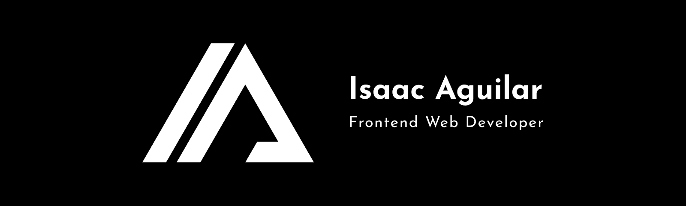

# Hi 👋, I'm Isaac

I'm a **Computer Science** student and a passionate self-taught **Frontend Web Developer** from Tegucigalpa, Honduras. I enjoy working with **JavaScript** and **Python**, but I'm always learning new things. In my free time I like to read blogs about tech news, I also like to exercise and listen to music. I aspire to be a Full Stack Web Developer one day and contribute more to open-source projects.

### 💻 Languages

### 🛠 Tools

